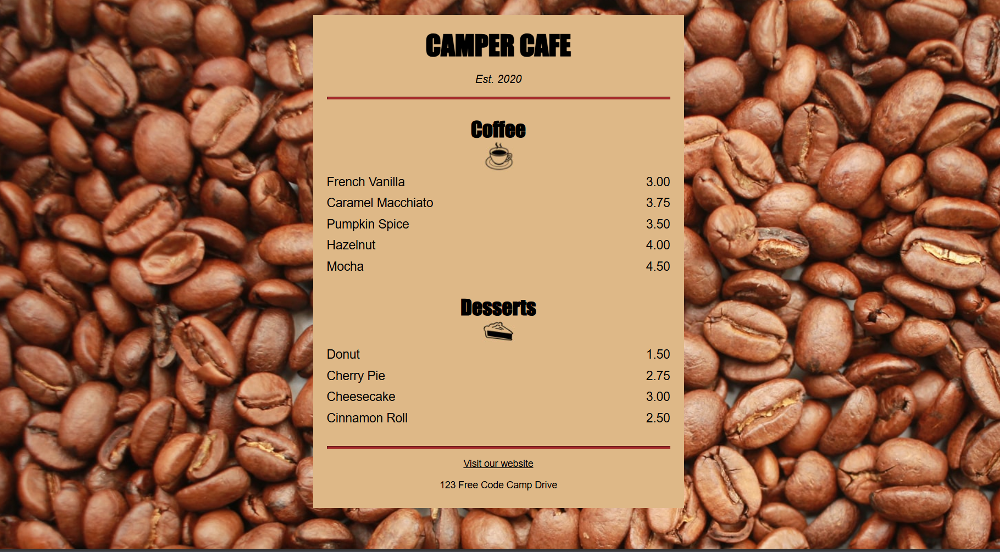

#  Cat Menu

## 📌 Overview

The Cafe Menu project is a simple yet stylish webpage designed to showcase a café's offerings using semantic HTML and CSS. It focuses on clean typography, structured layout, and responsive design principles.

## 🌐 Live Demo

[View Demo](https://razeen-shaikh.github.io/cafe-menu/)

## 📦 Features

- 🍽️ Elegant menu layout with clear sections for food and drinks.
- 🎨 Styled with CSS to enhance readability and aesthetics.
- 📱 Responsive design ensuring compatibility across devices.
- 🔤 Typography-focused approach for a visually appealing menu.
- 🏗️ Structured HTML elements for accessibility and clarity.

## 📁 Folder Structure

```txt
project-root/
│── index.html      # Main HTML file
│── styles.css      # CSS styling for layout and components
│── images/         # (Optional) folder for menu images
```

## 🚀 Getting Started

To run this project locally:

1. Clone the repository.
2. Open index.html in a browser.

## 🛠️ Tech Stack

- HTML5
- CSS3

## 📸 Screenshots



## 👨‍💻 Author

Razeen
💼 [Portfolio](https://www.razeen.dev)
